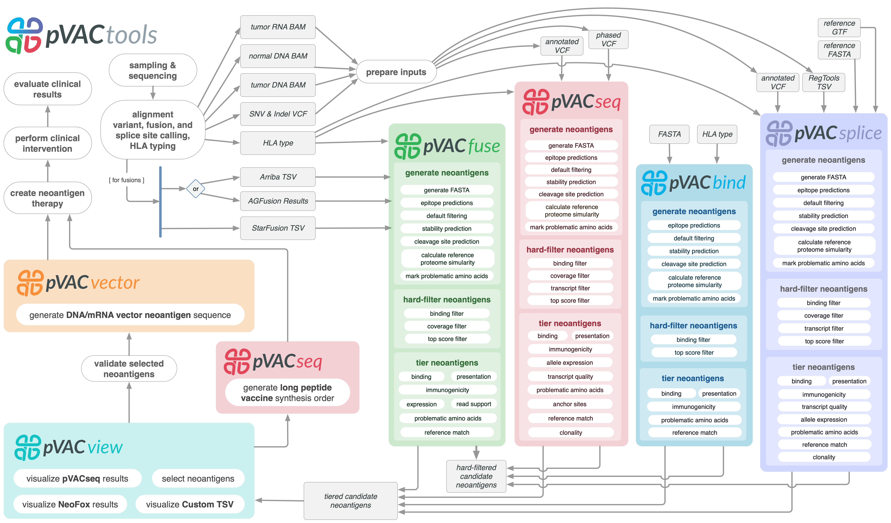

pVACtools
=========

pVACtools is a cancer immunotherapy tools suite consisting of the following
tools:

**pVACseq**
   A cancer immunotherapy pipeline for identifying and prioritizing neoantigens from a VCF file.

**pVACbind**
   A cancer immunotherapy pipeline for identifying and prioritizing neoantigens from a FASTA file.

**pVACfuse**
   A tool for detecting neoantigens resulting from gene fusions.

**pVACsplice**
   A tool for detecting neoantigens resulting from splice site variants.

**pVACvector**
   A tool designed to aid specifically in the construction of DNA-based
   cancer vaccines.

**pVACview**
   An application based on R Shiny that assists
   users in reviewing, exploring and prioritizing neoantigens from the results of
   pVACtools processes for personalized cancer vaccine design.

Contents
--------

.. toctree::
   :maxdepth: 2

   pvacseq
   pvacbind
   pvacfuse
   pvacsplice
   pvacvector
   pvacview

.. toctree::
   :maxdepth: 1

   install
   helper_tools
   courses
   tools
   frequently_asked_questions
   releases
   license
   citation
   funding
   contribute
   contact
   mailing_list

New in Version 7
----------------

This is a major version release. Please note that pVACtools 7.0 is not guaranteed to be
backwards-compatible and certain changes could break old workflows.

New Tools
_________

* pVACseq now has the option of running machine learning (ML)-based neoantigen prioritization
  predictions. The ML predictor uses a trained random forest model to predict whether neoantigen
  candidates in the aggregated report should be evaluated as "Accept", "Reject", or "Pending"
  based on a comprehensive set of features derived from binding affinity predictions, expression
  data, and variant characteristics. The ML predictor can be enabled by adding the ``--run-ml-predictions``
  parameter to a pVACseq run. More details can be found in the :ref:`output file documentation <ml_prediction_output>`,
  the :ref:`vignette <pvacseq_vignette>`.

New Features
____________

- pVACtools now supports multiple additional prediction algorithms:

  - MixMHCpred (class I binding score and percentile)
  - MixMHC2pred (class II binding score and percentile)
  - PRIME (class I immunogenicity score and percentile)
  - ImmuScope (class II immunogenicity score)

- In order to support a more comprehensive evaluation of candidates, aggregate binding, presentation,
  and immunogenicity information is now available in the final reports and is used to filter, prioritize,
  and tier candidates:

  - Best and median binding percentiles, presentation percentiles and
    immunogenicity percentiles are now calculate in the all_epitopes.tsv,
    filtered.tsv, and aggregated.tsv files in addition to the previously
    available combined percentiles that were aggregating percentile ranks
    over all prediction algorithms regardless of algorithm type.
  - Three new parameters - ``--binding-percentile-threshold``, ``--presentation-percentile-threshold``,
    and ``--immunogenicity-percentile-threshold`` replace the old
    ``--percentile-threshold``. These three new thresholds have been updated
    to use a default of 2.0 instead of not having a default. This means that
    filtering and tiering will now by default include evaluation of binding,
    presentation, and immunogenicity percentiles.
  - The aggregate report ``PoorBinding`` tier now evaluates the IC50
    binding affinity as well as the binding percentile. Candidates failing
    either threshold (when a ``conservative`` ``--percentile-threshold strategy`` is
    selected, default) or both thresholds (when a ``exploratory``
    ``--percentile-threshold-strategy`` is selected) will be binned in this
    tier when all other evaluation criteria are passed.
  - Two new tiers, ``PoorPresentation`` and ``PoorImmunogenicity``, are
    added to bin candidates that failed the
    ``--presentation-percentile-threshold`` or
    ``--immunogenicity-percentile--threshold``, respectively, when all other
    evaluation criteria are passed.
  - pVACvector has been updated to work on the binding percentile instead of the
    combined percentile. The corresponding parameter has been renamed to
    ``--binding-percentile-threshold`` with a new default of 2.0. The junction
    output file header recording each junction's binding percentile has been
    updated from ``percentile`` to ``binding_percentile`` to reflect this change.
  - pVACview has been updated to display more information regarding
    immunogenicity and presentation scores.
  - pVACtools runs that do not use a binding predictor would previously skip
    the binding filter, top score filter, and the aggregate report creation. These
    steps will now be run.

- The ``--top-score-metric2`` has been updated for sorting candidates and
  determining the criteria for selecting the Best
  Peptide (in the aggregate report) and top candidate (in the top score
  filter). It is now a list of criteria to consider. All listed criteria are
  assigned a rank and the sum of those ranks is used. By default both the IC50
  (``ic50``) and the combined percentile (``combined_percentile``) are used.
  Other allowed values are the binding percentile (``binding_percentile``),
  the presentation percentile (``presentation percentile``), and the
  immunogenicity percentile (``immunogenicity_percentile``). Any number and
  combination of these five criteria may be specified.
- Not all prediction algorithms supported by pVACtools may support a
  percentile rank. In order to alleviate this issue, and to provide percentile
  ranks that have been consistently calculated, we have run predictions for
  all class I algorithms supported by pVACtools on 100,000 reference peptides each in
  lengths 8-11 and for the most common 1,000 human class I MHC alleles. These
  predictions support a new feature in pVACtools: normalized percentiles
  (``--use-normalized-percentiles``). With this option enabled, any of the
  pVACtools pipelines will calculate normalized percentiles scores for all
  predicted neoantigen candidates and selected prediction algorithms. These
  normalized percentile ranks will be used in place of percentile ranks
  calculated by the algorithms natively. Predictions for allele or lengths we
  have not calculated reference scores will result in ``NA`` percentile ranks.
  Turning on this option in class II runs or with non-human data will be
  ignored. The peptides used in our predictions and the raw scores we calculated are
  available at https://github.com/griffithlab/pvactools_percentiles_data.
- In pVACbind and pVACfuse the ``Mutation`` column name in the various report
  files has been renamed to ``Index`` in order to ensure consistency between
  these and other tools.

Past release notes can be found on our :ref:`releases` page.

To stay up-to-date on the latest pVACtools releases please join our :ref:`mailing_list`.

Citations
---------

Jasreet Hundal , Susanna Kiwala , Joshua McMichael, Chris Miller, Huiming Xia,
Alex Wollam, Conner Liu, Sidi Zhao, Yang-Yang Feng, Aaron Graubert, Amber Wollam,
Jonas Neichin, Megan Neveau, Jason Walker, William Gillanders,
Elaine Mardis, Obi Griffith, Malachi Griffith. pVACtools: A Computational Toolkit to
Identify and Visualize Cancer Neoantigens. Cancer Immunology Research.
2020 Mar;8(3):409-420. doi: 10.1158/2326-6066.CIR-19-0401.
PMID: `31907209 <https://www.ncbi.nlm.nih.gov/pubmed/31907209>`_.

Jasreet Hundal, Susanna Kiwala, Yang-Yang Feng, Connor J. Liu, Ramaswamy Govindan, William C. Chapman,
Ravindra Uppaluri, S. Joshua Swamidass, Obi L. Griffith, Elaine R. Mardis, and Malachi Griffith.
`Accounting for proximal variants improves neoantigen prediction <https://www.nature.com/articles/s41588-018-0283-9>`_.
Nature Genetics. 2018, DOI: 10.1038/s41588-018-0283-9. PMID: `30510237 <https://www.ncbi.nlm.nih.gov/pubmed/30510237>`_.

Jasreet Hundal, Beatriz M. Carreno, Allegra A. Petti, Gerald P. Linette, Obi
L. Griffith, Elaine R. Mardis, and Malachi Griffith. `pVACseq: A genome-guided
in silico approach to identifying tumor neoantigens <http://www.genomemedicine.com/content/8/1/11>`_. Genome Medicine. 2016,
8:11, DOI: 10.1186/s13073-016-0264-5. PMID: `26825632
<http://www.ncbi.nlm.nih.gov/pubmed/26825632>`_.

Huiming Xia, My H. Hoang, Evelyn Schmidt, Susanna Kiwala, Joshua McMichael, Zachary L. Skidmore, Bryan Fisk, Jonathan J. Song, Jasreet Hundal, Thomas Mooney, Jason R. Walker, S. Peter Goedegebuure, Christopher A. Miller, William E. Gillanders, Obi L. Griffith,  Malachi Griffith. `pVACview: an interactive visualization tool for efficient neoantigen prioritization and selection <https://genomemedicine.biomedcentral.com/articles/10.1186/s13073-024-01384-7>`_. Genome Medicine. 2024, 16:132, DOI: 10.1186/s13073-024-01384-7. PMID: `39538339 <http://www.ncbi.nlm.nih.gov/pubmed/39538339>`_. 

Source code
-----------
The pVACtools source code is available in `GitHub <https://github.com/griffithlab/pVACtools>`_.

License
-------
This project is licensed under `BSD 3-Clause Clear License <https://spdx.org/licenses/BSD-3-Clause-Clear.html>`_.
