.. image:: ../../images/pVACview_logo_trans-bg_sm_v4b.png
    :align: right
    :alt: pVACview logo

.. _pvacseq_vignette:

Vignette - Using pVACview to Evaluate Neoantigen Candidates
-----------------------------------------------------------

In this vignette, we will use demo data to demonstrate using pVACview to evaluate neoantigen candidates predicted by pVACseq. The demonstration dataset includes Class I and Class II neoantigen candidate files generated from the HCC1395 breast cancer cell line and its matched lymphoblastoid cell line HCC1395BL. You can also download the demo data `here <https://github.com/griffithlab/pVACtools/tree/master/pvactools/tools/pvacview/data>`_. 

Upload input data files
_______________________

First, navigate to the Upload page, and click on ``Load demo data``.
This will immediately load:

- A tsv of Class I data: a high level aggregated file that lists the best MHC-class-I predicted epitope for each variant, their binding affinity scores, and additional variant information (genomic coordinates, coverage, VAF, and expression of the variants and transcripts encoding the epitopes).
- A json file of Class I data: JSON file with detailed information about the predicted epitopes, as well as meta-information about the original pVACseq run, formatted for pVACview.
- A tsv for Class II data: an aggregated file that lists the best MHC-class-II predicted epitope for each variant.
- A list of genes of interest: in this example, it's a tsv of the cancer census hotspot gene list from COSMIC.

.. figure:: ../../images/screenshots/vignette/pvacview-loadDemoDataset.png
    :width: 1000px
    :align: right
    :alt: pVACview Vignette
    :figclass: align-left

Visualize and Explore
_____________________

You will next be taken to a view similar to this.

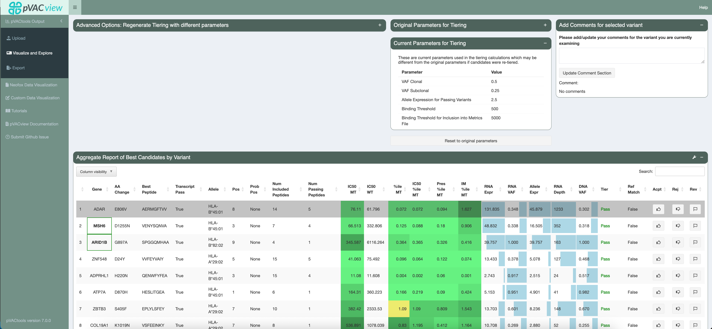

The top row of the page has 4 sections: 

- Advanced Options: Regenerate Tiering with different parameters
- Original Parameters for Tiering
- Current Parameters for Tiering
- Add Comments for selected variant

pVACview prioritizes neoantigen candidates by ranking these peptides based on a set of rules (:ref:`parameters for tiering <pvacseq_aggregate_report_tiers_label>`), which include variant allele fraction cutoff, gene/transcript expression, binding affinity predictions and more, as discussed later. Based on criteria described in the literature, we provide a default set of parameters for tiering, detailed in the **Original Parameters for Tiering** section. The default is a good starting point, but as all samples are unique in terms of sample quality, sequencing quality, tumor purity, tumor mutation burden, HLA type, etc. you may want to set your own parameters in the **Advanced Options: Regenerate Tiering with different parameters** section. To see the current set of rules applied to your data, see the **Current Parameters for Tiering** section.
Note: click the ``+``/ ``-`` in the right corner of a section to expand/contract the section.

The original parameters rank candidates on multiple facets:

**Clonality**

Cancer starts with a founding clone with tumor-initiating mutations which expand and drive malignancy. Descendents of the founding clone may acquire additional mutations. The default tiering assumes that neoantigen candidates derived from clonal variants should be prioritized as they exist in every cell of the tumor, while subclonal mutations are shared by some but not all of the cancer cells. It has been proposed that targeting such mutations will drive a better clinical response.

pVACview uses the following parameters when determining clonality:

- ``Tumor Purity`` : a value between 0 and 1 indicating the fraction of tumor cells in the tumor sample. (default: None)
- ``VAF Clonal`` : Tumor DNA variant allele frequency (VAF) to determine whether the variant is clonal. By default, this value is determined automatically from the VAFs in the input data during the original pVACseq run unless the tumor purity parameter is set (see :ref:`pVACseq docs <pvacseq_aggregate_report_tiers_label>` for further details). This can be adjusted by the user in pVACview (see below).
- ``VAF Subclonal`` : Tumor DNA VAF cutoff to determine whether the variant is subclonal. This value is automatically calculated as half of ``VAF Clonal``.

**Expression**

The ideal peptide candidate should be derived from a gene/transcript that is expressed robustly. We calculate allele expression by multiplying gene expression (often TPM or FPKM) by the RNA VAF and set a default cutoff of 2.5. Variants with expression lower than this cutoff will be marked with low expression. Users can adjust this cutoff based on their own knowledge of the dataset being analyzed:

- ``Allele Expression for Passing Variants`` : allele expression cutoff for passing variants. (default: 2.5 FPKM*VAF)

**Predicted Binding Affinity**

Binding affinity is measured by IC50 (peptide concentration required for 50% of displacement of a reference peptide to an MHC groove). Lower IC50 means a lower peptide concentration was required to achieve 50% displacement, which signifies better binding affinity. A common threshold for considering a peptide to be a strong binder is 500 nM. We also list the ``Binding Threshold for Inclusion into Metric File``. This parameter determines how many peptides the user wants to include in the peptide detailed view. Note that this parameter cannot be changed in the visualization component of pVACview but would need to be changed when generating the original aggregate report and metrics file. The default cutoff was set to 5000 nM to reasonably capture information about different peptide candidates from the same mutation but also to exclude those that have extremely poor binding.

- ``Binding Threshold``: IC50 value cutoff for a passing neoantigen. (default: 500 nM)
- ``Binding Threshold for Inclusion Into Metric File``: IC50 value cutoff for neoantigens to be loaded to pVACview. This feature helps limit the number of neoantigens being loaded to pVACview. (default: 5000 nM)

Additionally, percentile ranks are considered on top of raw IC50 predictions. Percentile rank is a method used to predict binding affinity, presentation, or immunogenicty of a peptide by comparing it to a set of peptides with similar sizes. A lower percentile rank indicates stronger affinity, presentation, or immunogencity, respectively. Percentile rank of less than 2% are generally
recommended (see `Jurtz, Vanessa et al. 2017 paper <https://www.ncbi.nlm.nih.gov/pmc/articles/PMC5679736/>`_). In contrast to IC50 predictions or raw scores, percentile ranks allow a more normalized comparison across different HLA alleles especially for binding where different alleles may have allele-specific binding cutoffs.

- ``Binding Percentile Threshold`` : binding percentile score cutoff.
  (default: 2)
- ``Presentation Percentile Threshold`` : presentation percentile score cutoff.
  (default: 2)
- ``Immunogenicity Percentile Threshold`` : immunogenicity percentile score cutoff.
  (default: 2)
- ``Percentile Threshold Strategy``: if set to ``conservative`` a candidate
  needs to pass the binding, binding percentile, presentation percentile and
  immunogenicity percentile thresholds. If set to
  ``exploratory`` a candidate only needs to pass one of the thresholds. (default:
  conservative)

When using the predicted IC50 values from binding prediction tools, another aspect to consider is the binding threshold of each allele. As stated earlier, different alleles may have allele-specific binding thresholds that vary from the default 500nM cutoff. Users can choose to use allele-specific binding threshold where data is available by turning this option on.

- ``Allele Specific Binding Threshold`` : this dictates whether the binding threshold is set specific to each allele based on `IEDB <https://help.iedb.org/hc/en-us/articles/114094151811-Selecting-thresholds-cut-offs-for-MHC-class-I-and-II-binding-predictions>`_ suggestion (option TRUE), or based on the ``Binding Threshold`` defined above (option FALSE). (demo data original value:  TRUE)

An important advantage of using pVACseq to generate neoantigen predictions is that multiple algorithms can be run (namely up to 15 Class I algorithms and up to 7 Class II algorithms). However, the user will need to decide whether the lowest or the median prediction value across algorithms should be used as themetric (IC50 MT, %ile MT, IC50 %ile MT, Pres %ile MT, and IM %ile MT columns) for each peptide-HLA combination. This cannot be changed in pVACview but is determined during the initial pVACseq run. To view which score metric (median or lowest) was used to compare binding affinity of mutant (MT) and wildtype (WT) peptides, we provide:

- ``MT Top Score Metric`` : mutant top score metric. (default: Median)
- ``WT Top Score Metric`` : wildtype top score metric. (default: Median)

Additionally, the ``HLA.Alleles`` and respective ``Binding.Cutoffs`` are also displayed.

- ``HLA.Alleles`` : is the list of HLA alleles that the sample expresses and given as input when running pVACseq.
- ``Binding.Cutoffs``: the IC50 cutoff value for the corresponding HLA allele.
  In the below example screenshots, allele-specific binding thresholds were used (``Allele Specific Binding Threshold: TRUE``). This results in the binding threshold for HLA-A*29:02 being set to the one recommended by `IEDB <https://help.iedb.org/hc/en-us/articles/114094151811-Selecting-thresholds-cut-offs-for-MHC-class-I-and-II-binding-predictions>`_. For the remaining alleles, IEDB does not have an specific binding threshold recommendation so the threshold is set to the basic binding threshold as a fallback, in this case 500 (``Binding Threshold: 500``).

**Transcript-level Features**

When predicting neoantigen candidates for a somatic variant, multiple transcripts of a gene may code for the same candidate. pVACseq will attempt to select the most likely transcript coding for a candidate (Best Transcript). The MANE Select, Canonical, and Transcript Support Level (TSL) may considered when picking the best transcript. When determining a candidate's tier, these criteria may also be taken into account. `TSL <https://useast.ensembl.org/info/genome/genebuild/transcript_quality_tags.html>`_ provides information on degree to which transcript isoforms are supported by experimental evidence. The existing TSL levels are: TSL1, TSL2, TSL3, TSL4, TSL5, TSLNA, with TSL1 being the best TSL level.  We suggest users using a higher TSL level cutoff (lower number) for higher confidence in the annotation of the targeted transcript. Default is set to be TSL1.

- ``Transcript Prioritization Strategy``: Users can specify up to three
  different criteria to consider. The best transcript will need to pass
  at least one of the specified criteria in order for the candidate to pass.
  (default: mane_select, canonical, tsl)

  - ``mane_select``: transcript is the MANE Select transcript
  - ``canonical``: transcript is the canonical transcript
  - ``tsl``: candidate meets the maximum TSL cutoff

- ``Maximum TSL`` : cutoff TSL level for a passing candidate. (default: 1)

**Anchor Positions**

Anchor positions can influence whether a neoantigen candidate may be recognized by the patient’s immune system. Thus, another aspect to consider is anchor contribution. A subset of  amino acid positions within the neoantigen candidate is more likely to face the TCR, while other positions are responsible for anchoring the peptide to the MHC. Anchor identity is determined by anchor likelihood score (more information about how the score is calculated `here <https://www.science.org/doi/10.1126/sciimmunol.abg2200?url_ver=Z39.88-2003&rfr_id=ori:rid:crossref.org&rfr_dat=cr_pub%20%200pubmed>`_). Anchor identity of the mutated amino acid can influence whether the neoantigen candidate is expected to induce an immune response or be subject to central tolerance of the immune system, as elaborated in the 4 scenarios discussed later. To examine whether the mutated amino acid is located at anchor position, we provide:

- ``Allele Specific Anchors Used`` : if TRUE, likelihood score is used to determine anchor position; if FALSE, position 1, 2, n-1 and n are set as anchor positions. (demo data original value: TRUE)
- ``Anchor Contribution Threshold`` : anchor likelihood score (between 0-1) cutoff to determine whether the amino acid is in anchor position. (default: 0.8)

.. rst-class:: three-images-row

.. image:: ../../images/screenshots/vignette/originalParametersForTiering/pvacview-OG_params_1.png
   :width: 48%
   :align: left
   :alt: pVACview Vignette

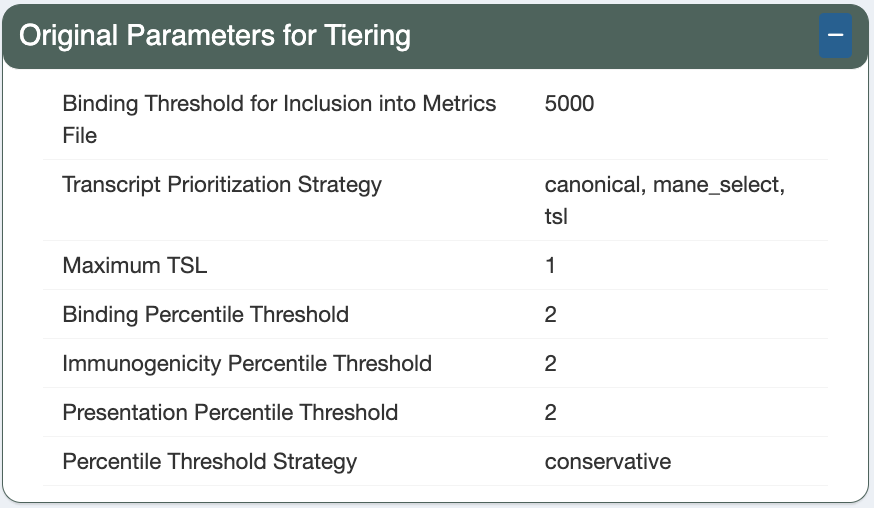

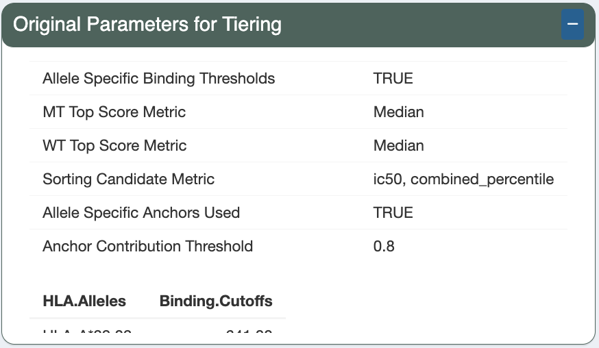

.. image:: ../../images/screenshots/vignette/originalParametersForTiering/pvacview-OG_params_4.png
   :width: 48%
   :align: center
   :alt: pVACview Vignette

To set your own Tier-setting parameters, expand the **Advanced Options: Regenerate Tiering with different parameters** section and tailor the parameters as needed. Learn more about Advanced Options `here <https://pvactools.readthedocs.io/en/stable/pvacview/getting_started.html#regenerate-tiering>`_.

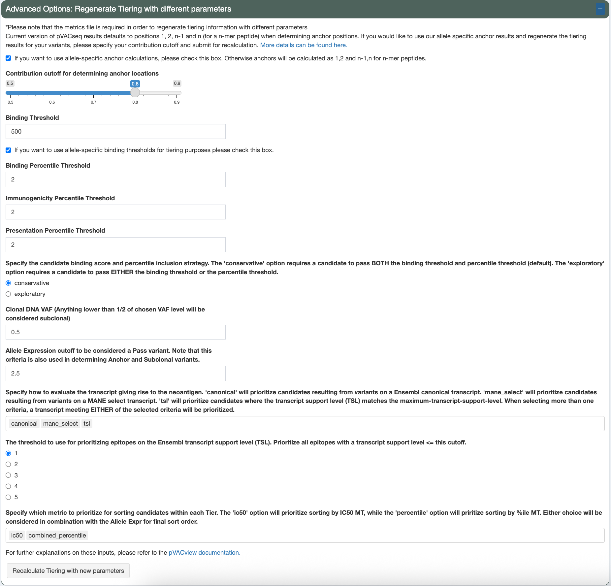

The second row of the page spans the **Aggregate Report of Best Candidates by Variant** section, which lists all neoantigen candidates in the provided input. Candidates with a higher Tier will be shown first, followed by candidates of lower Tiers (Order of Tiers: ``Pass``, ``PoorBinder``, ``RefMatch``, ``PoorTranscript``, ``LowExpr``, ``Anchor``, ``Subclonal``, ``ProbPos``, ``Poor``, ``NoExpr`` - see `Tiering criteria <https://pvactools.readthedocs.io/en/latest/pvacseq/output_files.html#tiers>`_). Genes that match with the user-input genes of interest list will have a green box around them (for example, TOM4, ARID1B and MSH6 are covered by a green box in this demo). This feature can be useful for highlighting neoantigens derived from cancer driver genes.

To view the variant, transcript, and peptide level information of a desired candidate, click on the candidate's row
to select it. The candidate currently under investigation will have a grey background. The number of the row
currently being investigated is indicated at the bottom of this section.

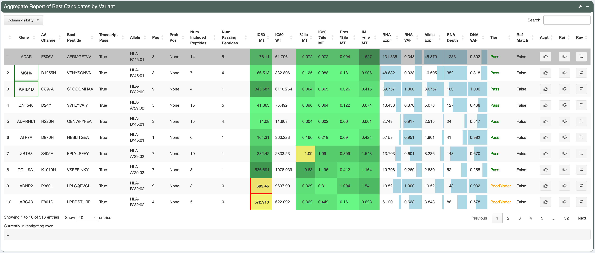

Next, we will evaluate some neoantigen candidates using the original parameters for Tiering.

Example 1: a good candidate: COL19A1-L1019N: VSDEEINKY
^^^^^^^^^^^^^^^^^^^^^^^^^^^^^^^^^^^^^^^^^^^^^^^^^^^^^^

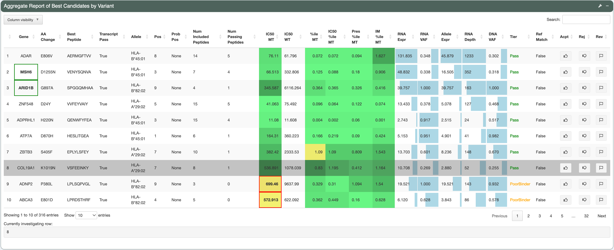

**Variant-level assessment:**

The variant has good DNA and RNA VAF (the DNA VAF is 0.255, higher than the Subclonal threshold of 0.25, thereby pVACseq assumes that the variant is clonal).

In this case, there’s only 1 mutant transcript that matches with the user-provided RNAseq data (**Transcript Sets of Selected Variant** tab shows only 1 result).

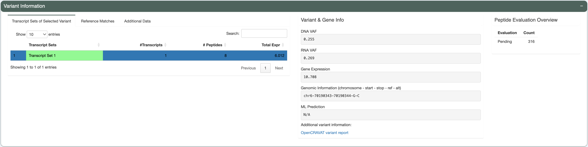

The predicted best peptide (neoantigen candidate) doesn’t have any match in the human proteome. This is ideal, since the candidate will more likely to be recognized by T cells and not ignored due to central tolerance.

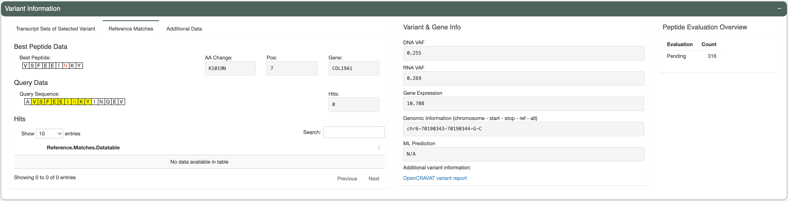

**Transcript-level assessment:**

The variant is detected in only 1 transcript. This transcript has good expression and Transcript Support Level and is the MANE Select and Canonical transcript. It also have a protein_coding biotype and no CDS flags.

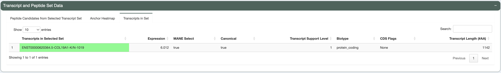

You can see the mutant (MT) and wildtype (WT) peptide sequence for this transcript side-by-side.

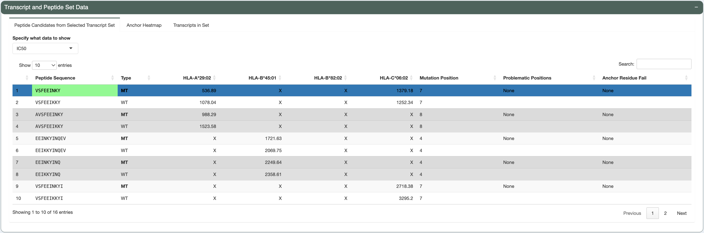

**Peptide-level assessment:**

The candidate being investigated has a good binding affinity for HLA-A*29:02 (median IC50 score is less than 641nM - the allele-specific binding threshold for this allele). Additionally, the median IC50, presentation, and immunogenicty percentile ranks for HLA-A*29:02 are less than 2% each. The violin plots and individual data tables also show acceptable concordance between the individual algorithms.

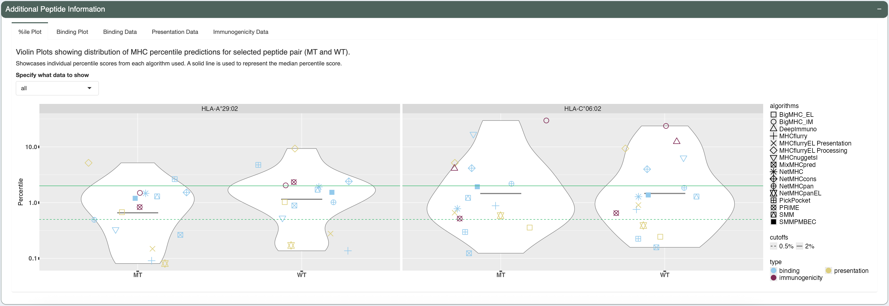

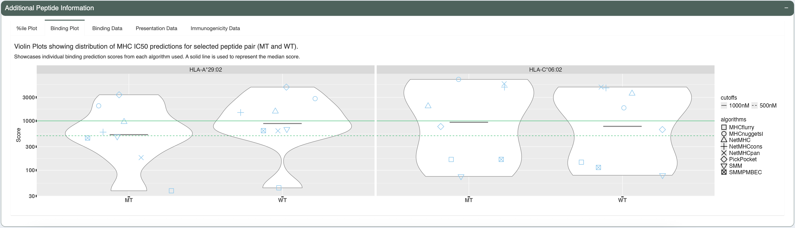

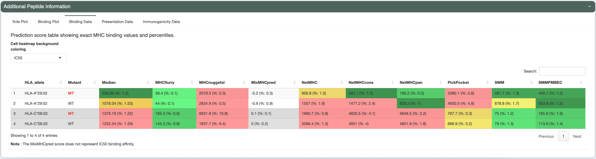

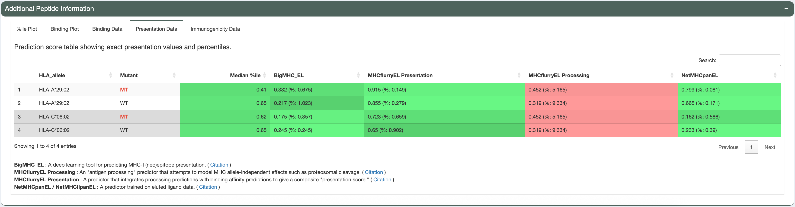

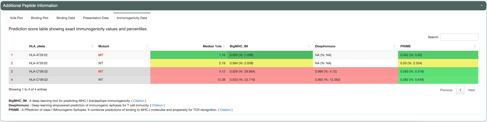

The mutation is not in an anchor position (see ``Anchor heatmap`` tab). A list of anchor positions for each allele-length combination
is provided in the ``Anchor Positions`` panel below. Additionally, the underlying anchor prediction scores for each amino acid position are
provided in the ``Anchor Weights`` panel at the bottom. While the mutant peptide (``VSFEEINKY``) is a good binder, the wildtype peptide (``VSFEEIKKY``) is a weak binder for HLA-A*29:02. This is scenario number 1 (WT weak binder, MT strong binder) according to the Scenario
Guide, where the neoantigen candidate is favorable and can be accepted.

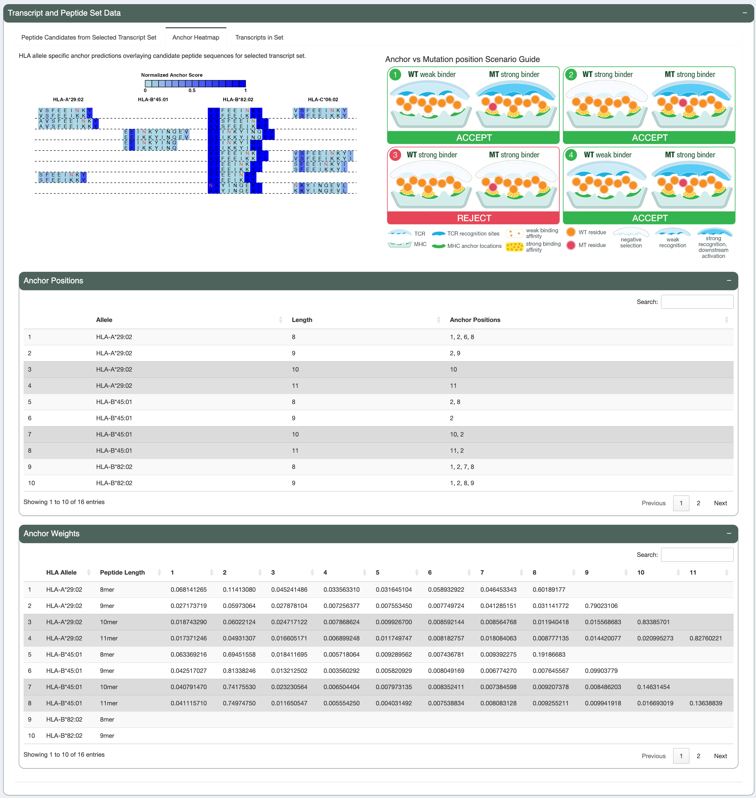

Beside the Class-I peptide, the best predicted Class-II peptide from the user-input can also be reviewed, using the **Additional Data** tab.

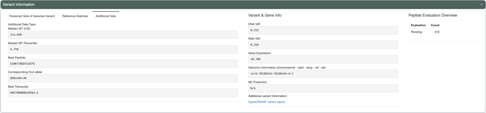

**Decision:**

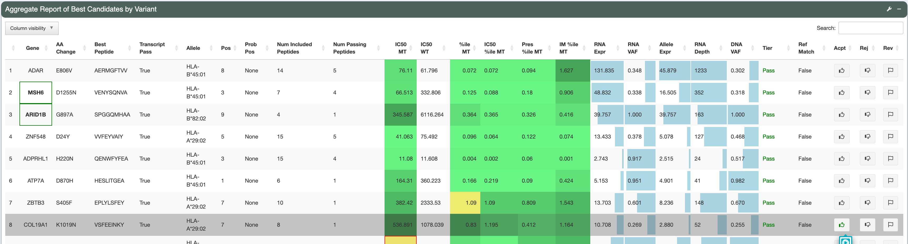

Given all the information above, we may conclude that the reviewed Class I peptide is potentially a good binder and
choose to accept this candidate by clicking the thumbs-up button.

Example 2: a good candidate derived from a variant with multiple transcript sets: ADAR-E806V: AERMGFTVV
^^^^^^^^^^^^^^^^^^^^^^^^^^^^^^^^^^^^^^^^^^^^^^^^^^^^^^^^^^^^^^^^^^^^^^^^^^^^^^^^^^^^^^^^^^^^^^^^^^^^^^^

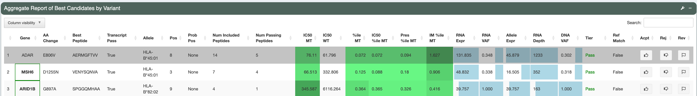

**Variant-level assessment:**

The variant has good DNA and RNA VAF (the DNA VAF is 0.302, higher than the Subclonal threshold of 0.25, thereby the variant is assumed to be clonal).

**Transcript-level assessment:**

Here, there are 2 transcript sets matching with the user-provided RNAseq data (**Transcript Sets of Selected Variant** tab shows 2 results). The transcript set highlighted in green (Transcript Set 2 in this case) is suggested as the one that includes the best neoantigen candidate. Transcript Set 2 has 13 transcripts, all of which give rise to 7 different neoantigen candidates. Transcript Set 1 has 1 transcript which gives rise to 9 different neoantigen candidates.

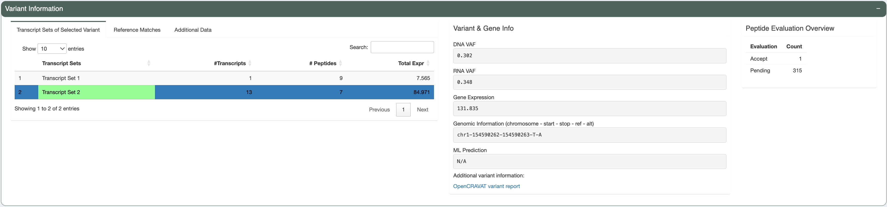

The images below are transcripts in Transcript Set 2 (top-middle, 13 transcripts) and Transcript Set 1 (bottom, 1 transcript). The transcript with the best neoantigen candidate is highlighted in green.

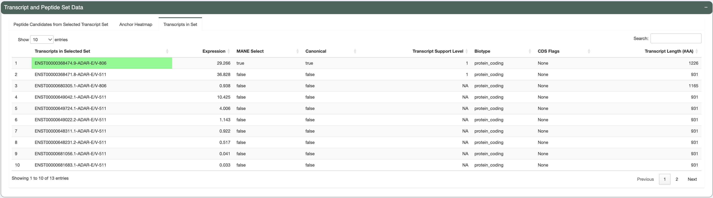

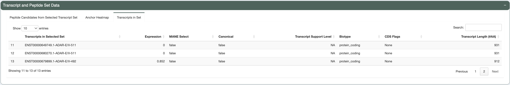

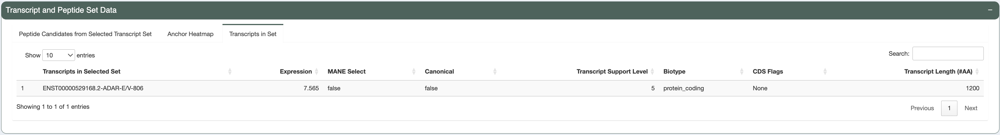

The images below are the neoantigen candidates from Transcript Set 2 (top) and Transcript Set 1 (bottom). The best neoantigen candidate (AERMGFTVV) is highlighted in green. Here, candidates are ranked based on IC50 score, the existence of problematic positions, and whether or not the peptide failed the anchor evaluation are also taken into account and candidates failing these criteria are deprioritized over candidates passing these criteria. As a result, a candidate with the lowest IC50 score is not always selected as the best peptide if these criteria aren't met. Additionally, the Best Peptide is always the first peptide in the list even if it isn't the one with the lowest IC50 score.

In this panel, users may also switch between displaying IC50, combined percentile, binding percentile, presentation percentile, or immunogenicity percentile using the "Specify what data to show" dropwdown. The peptide ordering is mainted from the IC50 view when switching to any of the percentile views meaning that the peptide order in the percentile views does not reflect the percentile rank ordering.

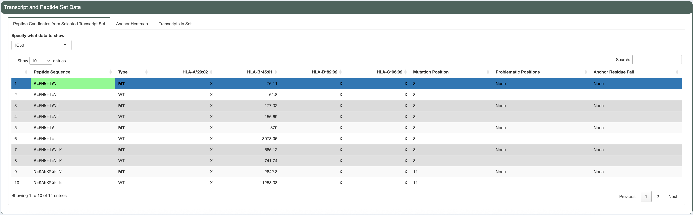

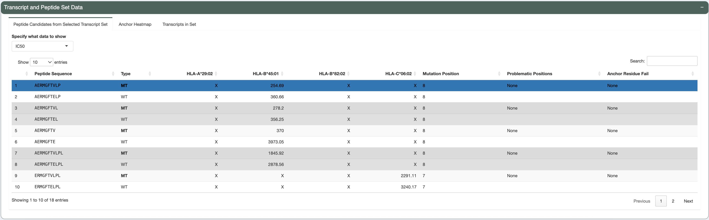

**Peptide-level assessment:**

For simplicity, we will review only the best peptide (AERMGFTVV). This candidate has good binding affinity (the median IC50 is 76.11nM, which is less than the 500nM cut-off). It also has good median binding, presentation, and immunogenicity percentiles (0.072, 0.094, and 1.627, respectively; which are all less than recommended cutoffs of 2). The predictions from all algorithms are in high agreement with no outliers, as seen in the violin plots.

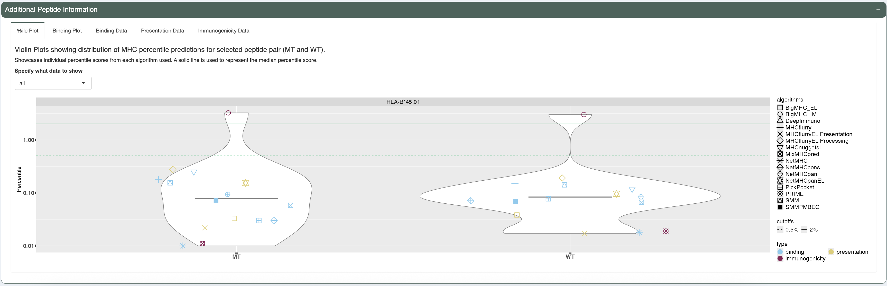

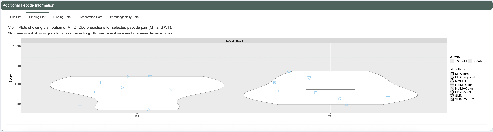

Altogether, both the candidate (mutant peptide - MT) and its wildtype (WT) peptide are strong binders. The figure below shows the mutated
amino acid (V) in the candidate (AERMGFTVV) is not in an anchor position for allele HLA-B*45:01. This fits into Scenario 2 in the guide,
where the candidate is likely to elicit strong recognition from the immune system.

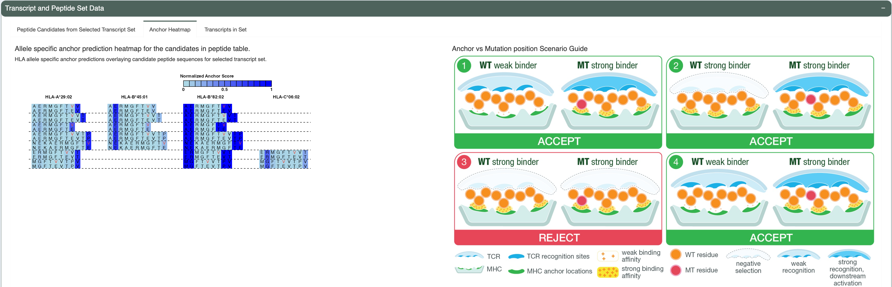

The candidate sequence also has no match with any known peptide in the human proteome.

.. figure:: ../../images/screenshots/vignette/ADAR/TranscriptSet1/ADAR_4_ReferenceMatches_TranscriptSet1.png
    :width: 1000px
    :align: right
    :alt: pVACview Vignette
    :figclass: align-left

**Decision:**

Given all the information above, we can conclude that the reviewed Class I peptide is potentially a good binder and
choose to accept by clicking the thumbs-up button.

Example 3: a bad candidate: ZNF141-H389Y: KIYTGEKPY
^^^^^^^^^^^^^^^^^^^^^^^^^^^^^^^^^^^^^^^^^^^^^^^^^^^
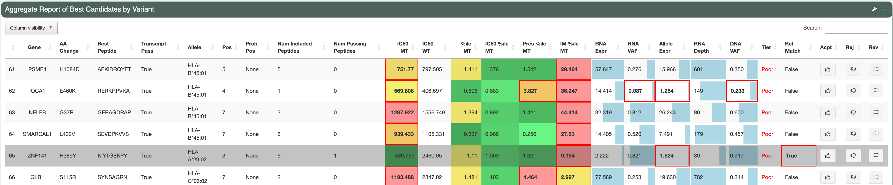

**Variant-level assessment:**

Given that the allele expression for passing variants is set at 2 (and a lot of gene has allele expression in the range of 5-114), ``Allele expression`` of this ZNF141 variant is low (1.824). 

Furthermore, the candidate peptide KIYTGEKPY matches with a sequence in the human reference proteome.

.. figure:: ../../images/screenshots/vignette/ZNF141/2_ReferenceMatches.png
    :width: 1000px
    :align: right
    :alt: pVACview Vignette
    :figclass: align-left

These potentially problematic characteristics are also flagged by the red boxes in the **Aggregate Report of Best Candidate by Variant** section.

**Decision:**

Since the candidate peptide has a match in the reference proteome, we will reject this candidate by clicking the
thumbs-down button.

ML-Based Neoantigen Evaluation Predictions
__________________________________________

This ML prediction output file contains ML-based evaluation predictions that can help prioritize neoantigen candidates by presetting the evaluation status for each candidate. 
When pVACseq is run with both MHC Class I and Class II predictions and the ``--run-ml-predictions`` flag enabled, or when using the :ref:`add_ml_predictions <optional_downstream_analysis_tools_label>` 
tool, an aggregate report file with ML predictions (``<sample_name>.MHC_I.all_epitopes.aggregated.ML_predict.tsv``) is generated in the same folder as the Class I aggregated file (``MHC_Class_I``). This file can be loaded into pVACview in combination with the Class I metrics.json file and the Class II aggregated file from their usual locations.
This file contains ML-based evaluation predictions that can help prioritize neoantigen candidates by presetting the evaluation status for each candidate.

The ML prediction file includes all columns from the Class I aggregated file with two columns different:

**Evaluation Column**

The ``Evaluation`` column is pre-populated with ML-predicted evaluation status for each candidate:

- ``Accept``: Variants with prediction probability >= ``--ml-threshold-accept`` (default: 0.55). These candidates are predicted to be favorable neoantigen candidates to be included in a vaccine. 
- ``Reject``: Variants with prediction probability <= ``--ml-threshold-reject`` (default: 0.30). These candidates are predicted to be unfavorable. ``--ml-threshold-reject`` should be set to a value less than ``--ml-threshold-accept``.
- ``Pending``: Variants with prediction probability between ``--ml-threshold-reject`` and ``--ml-threshold-accept``, or when the ML model cannot make a prediction due to missing data. These candidates require manual review.

**ML Prediction (score) Column**

The ``ML Prediction (score)`` column provides additional context by displaying the evaluation status along with the underlying prediction probability score. 
The format is ``"<Evaluation> (<probability_score>)"`` (e.g., ``"Accept (0.72)"``, ``"Reject (0.15)"``, ``"Review (0.48)"``). 
The "Review" status is retained in this column as a suggestion for users to change the status in the "Evaluation" column to "Review", or "Accept" or "Reject" manually.
This column shows ``"NA"`` when the ML model cannot make a prediction due to missing data (e.g., when a candidate is found in the Class I aggregated report but not in the Class II aggregated report).

The ``<probability_score>`` represents the model's confidence that a candidate should be accepted to be in a vaccine, with values closer to 1.0 indicating higher confidence in acceptance.

**Important Features Used by the ML Model**

The ML model integrates information from multiple sources to make its predictions. The following features are among the five most important factors considered:

- Allele expression
- RNA VAF
- RNA Expression
- NetMHCpan MT IC50 Score
- TSL

The model combines these features (and many more other features) using a trained random forest algorithm that has learned patterns from expert-reviewed neoantigen candidates. 
The predictions serve as a starting point for evaluation, but should be reviewed in conjunction with the detailed information available in pVACview, 
including binding affinity plots, anchor position analysis, and reference proteome matches.

**pVACview ML Predictions Example**

To view predictions on pVACview, load the following files: 
1. The ML prediction file (``<sample_name>.MHC_I.all_epitopes.aggregated.ML_predict.tsv``) in place of the Class I tsv file. 
2. The metrics.json file of Class I data. 
3. The Class II aggregated.tsv file.  
4. A list of genes of interest (optional).

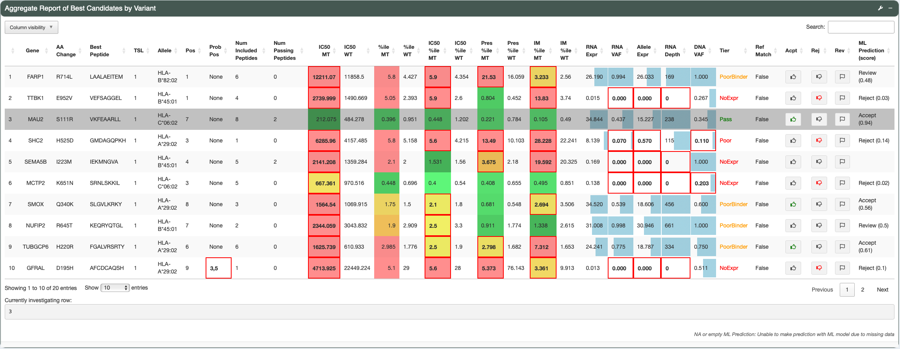

In the pVACview interface shown above, the ML prediction file is loaded in place of the standard Class I TSV file, with all 
other inputs as described. Candidate evaluation statuses are automatically pre-populated based on the ML predictions, as shown in the “Acpt,” 
“Rej,” and “Rev” columns, with prediction scores displayed in the “ML Prediction (score)” column. Users may review and override these assignments 
as needed.

In this example, MAU2 is classified in the Pass tier by pVACseq and predicted as Accept by the ML model, providing concordant support for its 
selection. In contrast, TUBGCP6 is labeled as a PoorBinder by pVACseq but predicted as Accept by the ML model, likely due to favorable features 
such as high expression and variant allele frequency (VAF), as well as potential Class II binding indicated in the Additional Data table (shown below). While 
this candidate may be provisionally accepted, further evaluation is needed to confirm that all Class II selection criteria are met.

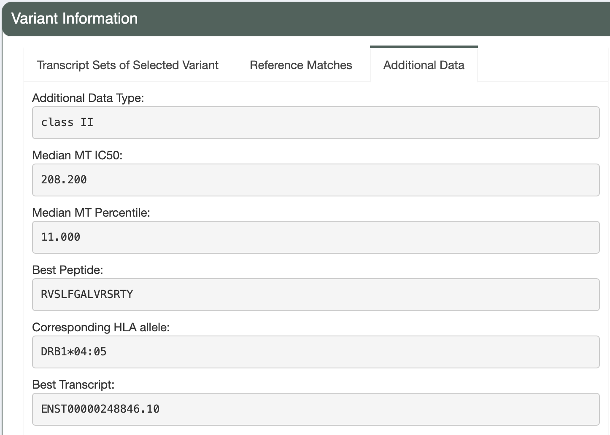

Export
______

After reviewing candidates, you can download the file with evaluation as a TSV or as an Excel sheet.

.. figure:: ../../images/screenshots/vignette/pvacview-export.png
    :width: 1000px
    :align: right
    :alt: pVACview Vignette
    :figclass: align-left

